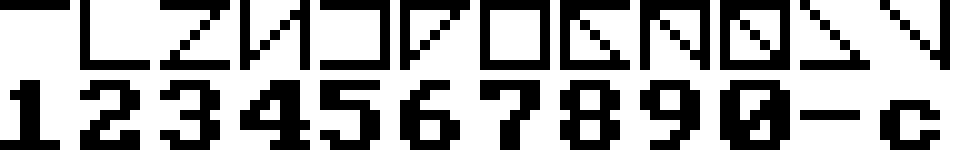

# C6\_88 teken- en taalset.
Dit is het hoofddocument C6\_30 van de C6\_88 teken- en taalset.
Deze is oorspronkelijk ontworpen door C4\_88 in de Nederlandse taal.

## Schrijfwijze
C6\_88 wordt beschreven in het Nederlands en opgemaakt met [Github Flavored Markdown (GFM)](https://github.github.com/gfm/).
We gebruiken de combinatie van terugstreep en onderstrepingsteken (\\\_) om een onderstrepingsteken weer te geven, zodat GFM er geen cursieve tekst van maakt.
In pad- en bestandsnamen is dat niet nodig en gebruiken we alleen het onderstrepingsteken.

## Hiërarchie
Documenten van C6\_88 bestaan in een stricte hiërarchie.
Ieder document moet geïnterpreteerd binnen de kaders van bovenliggende documenten.
De hiërarchie op het hoogste niveau staat in onderstaande lijst:
1. Dit document [C6\_30](README.md) is de top van de hiërarchie van C6\_88 en schept daarmee de context voor en kaders van al het andere.
2. [C6\_31](REGELS.md) bevat de regels voor het gebruik en de ontwikkeling van C6\_88.
3. [C6\_32](LICENCE) bevat de licentie rondom de auteursrechten en aanverwante zaken van C6\_88.
4. [C6\_33](CODE_OF_CONDUCT.md) bevat de gedragscode voor de gemeenschap die deelneemt aan C6\_88.
5. [C6\_34](CONTRIBUTING.md) bevat de richtlijnen voor deelnemers die willen bijdragen aan de ontwikkeling van C6\_88.
6. [C6\_35](https://github.com/bvangils/C6_88/wiki) bevat officieuze informatie over of in relatie tot C6\_88.

Ontwikkelde code die geen documentatie is, dient te voldoen aan de documentatie.

## C6\_88-tekens
Met het woord 'tekens' bedoelen we exclusief de 12 tekens waarmee in C6\_88 gecommuniceerd wordt.
De elementen van de taal, zoals 'code', 'symbolen', 'letters', 'cijfers' en anderen worden gevormd door een combinatie van tekens.
Om in het Nederlands en ASCII-script te kunnen verwijzen naar de tekens, hebben alle tekens een naam gekregen.
Het onderstaande overzicht bevat op de bovenste rij de C6\_88 tekens en op de onderste rij de verwijzende naam in ASCII Nederlands.

## Taalsets
Losse tekens betekenen niets, dat doen zij pas in de context van een taalset, die aan het begin van elk bericht benoemd wordt.
De communicatie van de taalset waarin gecommuniceerd met de tekens: Cn\_, waarbij n een teken is van 1 tot 9.
Er zijn nu 6 taalsets gedefinieerd.
Ieder van de sets heeft een doel:
* [C1\_ set](taalsets/C1_.md) Het alfabet, interpunctie en symbolen voor communicatie van tekst.
* [C2\_ set](taalsets/C2_.md) Cijfers, symbolen en operators voor rekenkundige communicatie in het achttallig stelsel.
* [C3\_ set](taalsets/C3_.md) Beperkte set concepten voor efficiëntere communicatie van basisboodschappen dan met de C1\_ set.
* [C4\_ set](taalsets/C4_.md) Eigennamen die verwijzen naar levende entiteiten.
* [C5\_ set](taalsets/C5_.md) Codes om programmering van een microprocessor of -controller over te dragen.
* [C6\_ set](taalsets/C6_.md) Eigennamen die verwijzen naar niet-levende entiteiten, zoals plaatsen, tijden en voorwerpen.

## Status
* De eerste officiële vrijgave van C6\_88 is bij Release 1.0.
    Tot die uitgave kunnen er onaangekondigd nog flinke veranderingen plaatsvinden.
